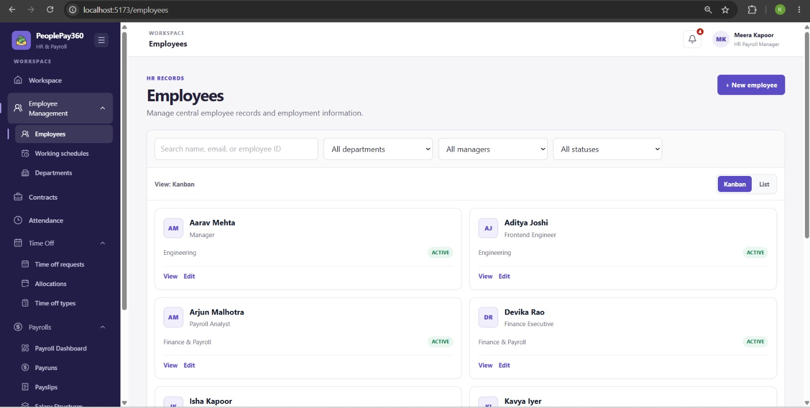
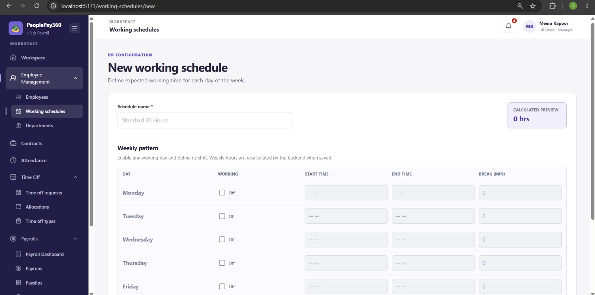
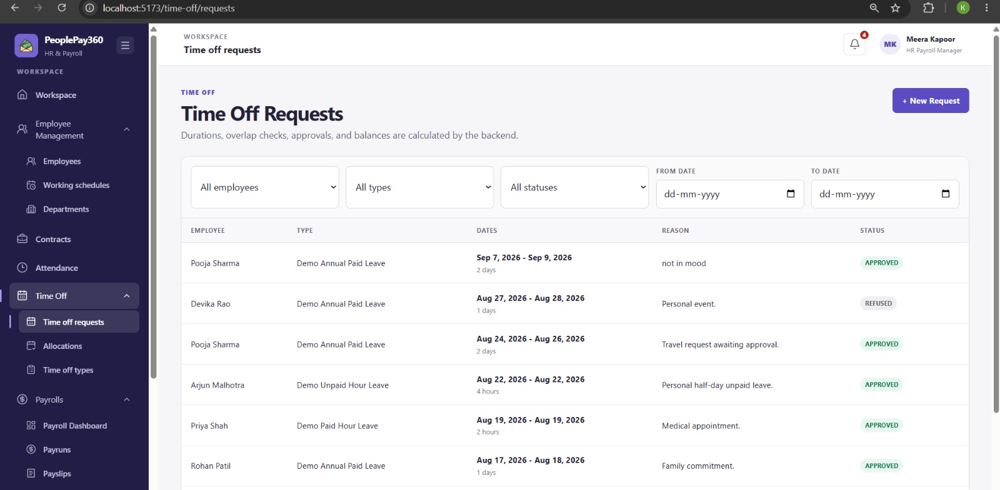
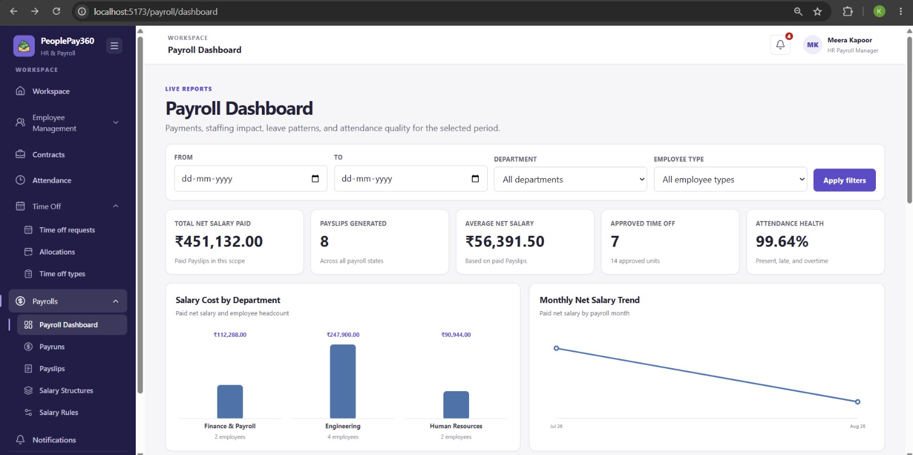
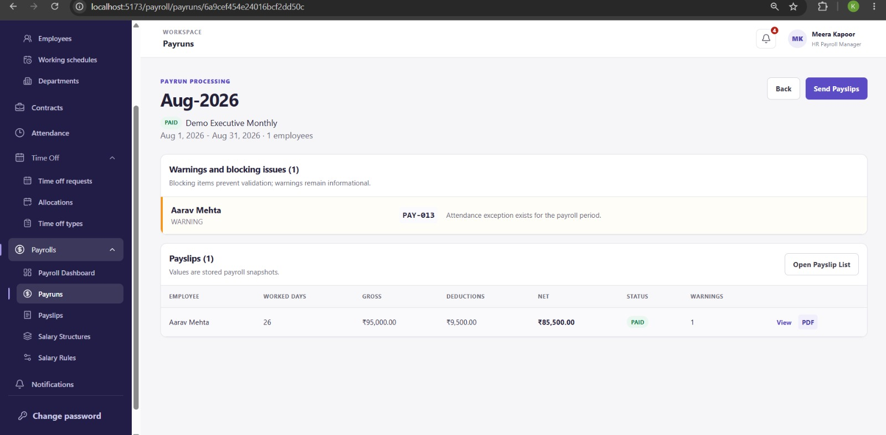

# PeoplePay360

PeoplePay360 is a full-stack HR and payroll application for managing people, contracts, attendance, leave, salary configuration, payroll runs, and payslips.

It is built as a modular MERN application:

- **Client:** React, Vite, React Router, Axios
- **Server:** Node.js, Express, Mongoose
- **Database:** MongoDB
- **Authentication:** JWT with role-based access control
- **Supporting services:** Nodemailer for account and payroll emails; PDFKit for payslip PDFs

## Features

- Secure sign-in, JWT sessions, password changes, and forgot-password recovery
- Forced password change after account provisioning or password reset
- User, employee, department, and working-schedule management
- Historical employee contracts with date-based payroll applicability
- Attendance and time-off management
- Salary structures and rules
- Payroll eligibility preview, payrun creation, calculation, validation, and marking paid
- Generated payslips and PDF export
- Dashboard, notifications, and payroll reporting

## Product screenshots

<table>
  <tr>
    <td width="50%" valign="top">
      <strong>Employee directory</strong><br />
      Search, filter, and manage employee records in list or Kanban views.<br /><br />
      
    </td>
    <td width="50%" valign="top">
      <strong>Working schedule configuration</strong><br />
      Define weekly shifts and preview backend-calculated working hours.<br /><br />
      
    </td>
  </tr>
  <tr>
    <td width="50%" valign="top">
      <strong>Time-off requests</strong><br />
      Review employee leave requests with date, type, and status filters.<br /><br />
      
    </td>
    <td width="50%" valign="top">
      <strong>Payroll dashboard</strong><br />
      Track paid salary, payslips, time off, attendance health, and payroll trends.<br /><br />
      
    </td>
  </tr>
  <tr>
    <td width="50%" valign="top">
      <strong>Payrun processing</strong><br />
      Review payroll warnings, payslip snapshots, net pay, and payment status.<br /><br />
      
    </td>
    <td width="50%"></td>
  </tr>
</table>

## Roles

| Role | Primary access |
| --- | --- |
| `ADMIN` | User administration and full platform access |
| `HR_MANAGER` | HR configuration and operations |
| `HR_PAYROLL_USER` | Payroll operations |
| `HR_PAYROLL_MANAGER` | Payroll management and approval actions |
| `EMPLOYEE` | Personal profile, attendance/time-off actions, and personal payslips |

## Prerequisites

- Node.js 20 or newer
- npm
- MongoDB (local instance or MongoDB Atlas connection string)
- SMTP credentials for account-reset and email features

Use a browser-safe API port such as `5000`, `5001`, `8000`, or `8080`. Port `6000` is blocked by Chromium browsers and causes `ERR_UNSAFE_PORT`.

## Quick start

1. Clone the repository and install dependencies for both applications.

   ```bash
   git clone <repository-url>
   cd PeoplePay360

   cd server
   npm install

   cd ../client
   npm install
   ```

2. Create local environment files from the examples.

   ```bash
   cp server/.env.example server/.env
   cp client/.env.example client/.env
   ```

3. Configure `server/.env`.

   ```env
   NODE_ENV=development
   PORT=5000
   MONGODB_URI=mongodb://127.0.0.1:27017/peoplepay360
   JWT_SECRET=replace-with-a-long-random-secret
   JWT_EXPIRES_IN=1d

   CLIENT_URL=http://localhost:5173

   SMTP_HOST=smtp.example.com
   SMTP_PORT=587
   SMTP_SECURE=false
   SMTP_USER=your-smtp-user
   SMTP_PASSWORD=your-smtp-password
   SMTP_FROM=payroll@example.com

   BOOTSTRAP_ADMIN_EMAIL=admin@example.com
   BOOTSTRAP_ADMIN_PASSWORD=replace-with-a-secure-bootstrap-password
   BOOTSTRAP_ADMIN_FIRST_NAME=System
   BOOTSTRAP_ADMIN_LAST_NAME=Administrator
   ```

   `MONGODB_URI` and `JWT_SECRET` are required for the API to start. The bootstrap-admin variables are required only when the database does not yet contain an admin account. SMTP is required for invitation, password-reset, and email features.

4. Set the frontend API address in `client/.env`.

   ```env
   VITE_API_URL=http://localhost:5000/api/v1
   ```

   Keep this port aligned with `server/.env` `PORT`. Restart Vite after changing a `VITE_*` value, and restart the backend after changing its `.env`.

5. Start the API and frontend in separate terminals.

   ```bash
   cd server
   npm run dev
   ```

   ```bash
   cd client
   npm run dev
   ```

Open the URL shown by Vite (normally `http://localhost:5173`). Confirm the API is available at `http://localhost:5000/api/v1/health`.

## Available scripts

### Server

Run these from `server/`.

| Command | Purpose |
| --- | --- |
| `npm run dev` | Start the API with nodemon |
| `npm start` | Start the API with Node.js |
| `npm test` | Run the Node.js test suite |
| `npm run seed:salary` | Seed salary structures/rules |
| `npm run seed:august-demo` | Seed the August payroll demo data |
| `npm run seed:demo` | Seed the demo company data |

### Client

Run these from `client/`.

| Command | Purpose |
| --- | --- |
| `npm run dev` | Start the Vite development server |
| `npm run build` | Create a production build |
| `npm run preview` | Preview the production build |
| `npm run lint` | Run ESLint |

## API overview

The REST API base URL is `/api/v1`.

| Resource | Base path |
| --- | --- |
| Health | `GET /health` |
| Authentication | `/auth` |
| Users | `/users` |
| Departments | `/departments` |
| Working schedules | `/working-schedules` |
| Employees | `/employees` |
| Contracts | `/contracts` |
| Salary configuration | `/payroll/...` |
| Payruns | `/payroll/payruns` |
| Payslips | `/payroll/payslips` |
| Attendance | `/attendance` |
| Time off | `/time-off/...` |
| Dashboard | `/dashboard` |
| Notifications | `/notifications` |

Authentication requests include the JWT as a bearer token:

```http
Authorization: Bearer <access-token>
```

Useful unauthenticated endpoints:

```text
POST /api/v1/auth/login
POST /api/v1/auth/forgot-password
GET  /api/v1/health
```

## Password recovery

The login page includes **Forgot password?**. A request for an active account sends a temporary password to the account email. Sign in with that temporary password, then set a new password when prompted.

For security, the API returns the same success response whether an account exists or not. If delivery fails, inspect the backend terminal for the SMTP error and verify the SMTP values in `server/.env`.

## Payroll lifecycle

The payroll flow preserves historical data and uses the following states:

```text
DRAFT → COMPUTED → VALIDATED → PAID
```

- Eligibility preview does not create a payrun.
- A payrun is created as `DRAFT` only after employees are explicitly selected.
- Computation is idempotent before validation.
- Validation is blocked by payroll errors.
- `PAID` payruns are immutable.

## Project structure

```text
PeoplePay360/
├── client/                  # React + Vite application
│   └── src/
│       ├── app/             # Router and providers
│       ├── features/        # Feature pages and API calls
│       ├── layouts/         # Authenticated and auth layouts
│       └── shared/          # Shared UI, API, constants, permissions
├── server/                  # Express + Mongoose API
│   ├── scripts/             # Demo/data seed scripts
│   ├── src/
│   │   ├── config/          # Environment, database, and mail setup
│   │   ├── core/            # Errors, security, middleware, HTTP helpers
│   │   ├── modules/         # Business modules
│   │   ├── routes/          # API route composition
│   │   ├── app.js           # Express application setup
│   │   └── server.js        # API bootstrap
│   └── tests/               # Node.js tests
└── README.md
```

## Notes for contributors

- Keep business logic in backend services, not controllers or frontend components.
- Use the canonical payroll lifecycle and role values shown above.
- Do not commit `.env` files, SMTP credentials, database URLs, or JWT secrets.
- Run targeted tests for the module you change; run the full suite before a release or merge when appropriate.
